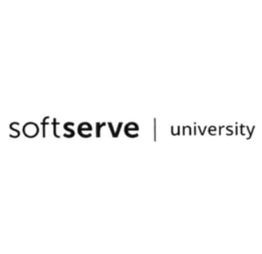

<!-- _class: cover -->

# 🔍 Аналіз торговельної марки
## SoftServe University

Свідоцтво №339903 · Україна · 2023

**Дисципліна:** IT та правовий захист · **2025–2026**

---

# 1. Вибір торгової марки

### 🏷️ Загальна інформація
- **Торговельна марка:** SoftServe University
- **Охоронний документ:** Свідоцтво №339903
- **Статус:** ✅ Свідоцтво діє
- **Дата реєстрації:** 15 листопада 2023

### 🔑 Ключові слова
- IT-курси, освітня програма, кібербезпека
- дуальна освіта, serve, soft, softserve
- softserve university, university

---

# 2. Пошук в реєстрах

### 👤 Власник
**ТОВ «СОФТСЕРВ-УКРАЇНА»** · вул. Володимира Великого, м. Львів, 79053 (UA)

### 📦 Клас 09 — ПЗ та техніка
- Навчальні платформи та застосунки
- Цифрові матеріали (відео, аудіо, е-видання)
- Комп'ютери, мобільні пристрої, периферія
- Носії та засоби зберігання даних

### 📢 Клас 35 — Бізнес
- Реклама та просування освітніх продуктів
- Цифровий маркетинг і SEO
- Аналітика ринку, управління БД
- Організація онлайн-платформ

### 🎓 Клас 41 — Освіта
- Курси, тренінги, програми навчання
- Семінари, конференції, форуми
- Дистанційне та онлайн-навчання
- Менторство та перепідготовка

### 💻 Клас 42 — IT-послуги
- Розробка ПЗ, SaaS / PaaS рішення
- Хмарні обчислення та зберігання даних
- Кібербезпека та захист даних
- Тестування та моніторинг систем

---

# 3. Аналіз торговельної марки

### 🛡️ Що захищається
Словесний знак **«SoftServe University»** — у всіх формах написання, шрифтах та кольорах.
Захищається від будь-якого схожого позначення, що може ввести споживача в оману.

### 🌐 Сфера використання
💻 IT 📢 Маркетинг 🎓 Освіта

### ⚠️ Міжнародний статус
- Міжнародна реєстрація **відсутня**
- Марка є **національною** (Україна)
- Система Мадрид (WIPO) — продовження **не виявлено**

### 🔗 Ресурси реєстрації
- [iprop-ua.com/tm/k04otzwx](https://iprop-ua.com/tm/k04otzwx)
- [sis.nipo.gov.ua — деталі](https://sis.nipo.gov.ua/uk/search/detail/1460221/)

### 📌 Ключові факти
- Захист у **4 класах МКТП**: 09, 35, 41, 42
- Тип знаку: **словесний**
- Дата реєстрації: **15.11.2023**

---

# 4. Аналіз компанії та стандартів

### 📋 Стандарти безпеки
- **ISO/IEC 27001:2022** — ISMS, Zero Trust, щорічні аудити
- **ISO/IEC 27701:2019** — управління приватністю, GDPR
- **ISO/IEC 20000-1:2018** + ITIL — управління IT-послугами
- **ISO 13485** — медичні IT-рішення

### ⚖️ Нормативна відповідність
- **GDPR** — персональні дані
- **HIPAA** — медична інформація
- **PCI DSS** — платіжні картки
- **NIST CSF · OWASP Top 10**

### 💡 Вплив на розробку

Будь-який проект із брендом SoftServe вимагає: RBAC, шифрування, логування, SOC 2 / ISO-сумісного коду.

### Обов'язкові вимоги
- 🔐 **RBAC** — ролі та права доступу
- 🔒 **Шифрування** — дані в русі та у спокої
- 📋 **Логування** — аудит подій безпеки
- 📄 **DPA + NDA** — з кожним партнером

Порушення → розірвання контракту + штрафи + репутаційні втрати

---

# 5. Судова практика

### 🔎 Результати пошуку в ЄДРСР

Пошук за «ТОВ «СОФТСЕРВ-УКРАЇНА»», «SoftServe University» у Єдиному державному реєстрі судових рішень <strong>не виявив жодних справ</strong> щодо порушення прав на торговельну марку (станом на березень 2026).

### 📌 Єдиний виявлений випадок — 14 березня 2011 року

**Предмет спору:** ТОВ «СОФТСЕРВ-УКРАЇНА» проти Державної податкової інспекції

- Скасування податкових рішень
- Витрати на створення об'єктів ІВ (комп'ютерні програми працівників)
- Питання ПДВ при постачанні послуг нерезидентам (IT-експорт)

> 💡 Відсутність судових суперечок щодо ТМ свідчить, що марка поки не оспорювалась — але це не знижує ризики порушення з боку третіх осіб.

---

# 6. Уявна ситуація порушення

### 📌 Сценарій
Команда розробляє **освітню платформу** для IT-курсів і:
- Використовує в дизайні логотип **«SoftServe University»** без дозволу
- Називає платформу **«SoftServe Dark Academia»**

### ⚖️ Що порушено

п. 5 ст. 16 ЗУ «Про охорону прав на знаки для товарів і послуг» — свідоцтво надає власнику виключне право забороняти використання без його згоди.

### 👥 Хто несе відповідальність
- **Юридична особа** (розробник) — безпосереднє використання ТМ без дозволу
- **Керівник компанії** — адміністративна відповідальність за дії компанії
- **Замовник** — якщо в ТЗ явно вказано використати схожий логотип

### ✅ Як уникнути
1. Перевірити бази **Ukrpatent / iprop-ua.com** до старту
2. Отримати **письмову ліцензію** від власника ТМ
3. Використовувати **оригінальний дизайн** без схожості до ТМ

---

# 7. Висновок та пропозиції

### 📊 Висновок
- ТМ «SoftServe University» — **сильний актив** у IT-сфері
- Захист у 4 класах МКТП, топові стандарти (ISO 27001, GDPR)
- Судових спорів щодо ТМ — **не виявлено**
- Порушення несе **високі ризики**: фінансові, репутаційні, кримінальні

### 🚨 Ризики для розробників
- 💸 Фінансові збитки та штрафи
- 🚫 Блокування сайту / продукту
- 👤 Втрата клієнта та репутації

### 🛠️ Рекомендації команді
- 🔍 **TM-пошук** перед кожним проектом (iprop-ua.com + юрист)
- 📝 **Реєстрація власної ТМ** — якщо створюєте унікальний продукт
- 📄 **DPA + security review** — з першого дня роботи із замовником
- 🔐 **ISO 27001 / GDPR / PCI DSS** — при роботі з даними користувачів

🎯 Впровадити <strong>«IP due diligence»</strong> на етапі пресейлу — 15 хвилин перевірки значно знижують правові ризики.

---

<!-- _class: cover -->

# Дякуємо за увагу! 🙏

### 🔗 Джерела

[iprop-ua.com](https://iprop-ua.com/tm/k04otzwx) · [sis.nipo.gov.ua](https://sis.nipo.gov.ua/uk/search/detail/1460221) · [reyestr.court.gov.ua](https://reyestr.court.gov.ua) · [softserveinc.com](https://softserveinc.com)· [softserveinc.com](https://softserveinc.com)